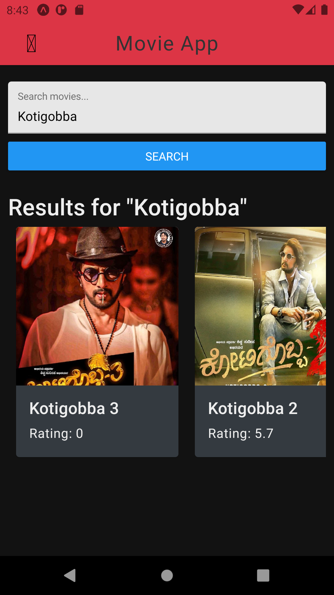

## Movie Search App

> > A simple app that displays the details of movies, built using React native and [TMDB API](https://www.themoviedb.org/).

### Screenshots

<h6>
#1 Home Screen | #2 Category Screen | #3 Search Screen | #4 Details Screen
</h6>

